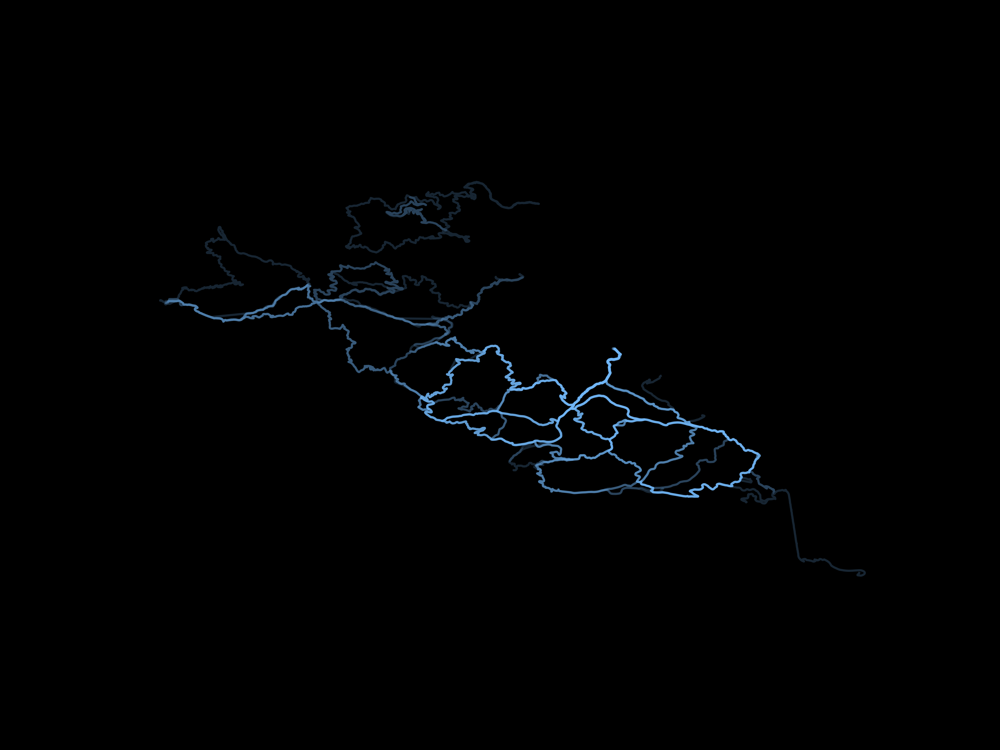
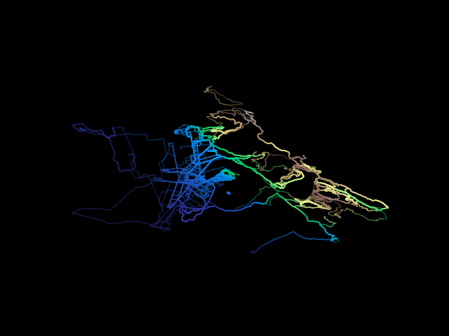
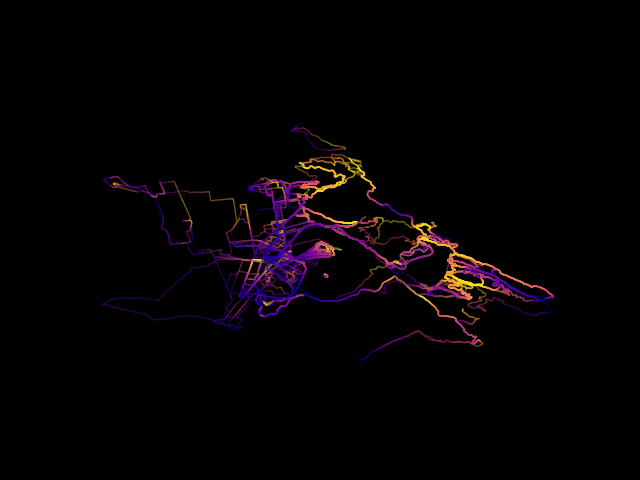

# heatmap

Generate heatmap pictures from gpx data, optional strava downloader.

1. Run *download.py* to get your strava *gpx* data
2. Run *draw.py* to create some pictures
    * You can either cluster by common location, enter a lat-lon pair, use your current location (by
      ip), or plot all tracks

## Examples

* `./draw.py cluster --activity-type 9`:

* `./draw.py cluster --line-color cmap:terrain --activity-type 9 --line-alpha .5`:
   * if the line color has the form `cmap:<name>` the color map name after the colon will be used.
   the color level will be determined by the each track's altitude information normalized to the
   min and max values over all tracks

* `./draw.py cluster --line-color lcmap:plasma --activity-type 9 --line-alpha .5`:
   * if the line color has the form `l(ocal)cmap:<name>` the color map name after the colon will be
   used. the color level will be determined by the altitude information normalized to the
   min and max values of each individual track

## Colors

for available colors look at the
[named colors page](https://matplotlib.org/3.1.0/gallery/color/named_colors.html)
or use a color from the [xkcd color survey](https://xkcd.com/color/rgb)
with `--<target>-color xkcd:<color name>`. for colormaps look
[here](https://matplotlib.org/3.1.1/gallery/color/colormap_reference.html)
